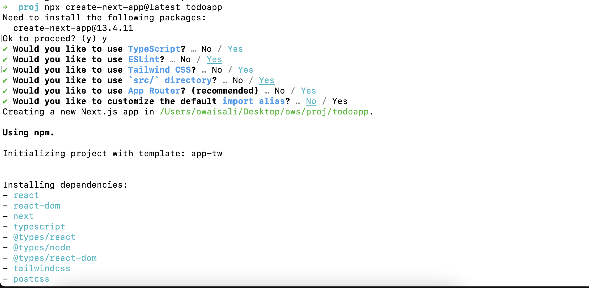

# Creating TODO CRUD app in NextJS 13 + Drizzle + Postgres

## Introduction to Next 13 APIs and NextJS APIs vs ExpressJS

In this tutorial we are going to learn how do we create CRUD Apis in Next 13 by building a TODO Application (which is the favorite choice for many developers to build it as a first project).

We will create APIs using latest app router introduced in Next 13. Next 13 uses file based routing for frontend as well as for its APIs (so unlike ExpressJS there is no need for separate router file or configuration). We will use and see how powerful NextRequest and NextResponse objects are in Next 13, which, unlike ExpressJS, will give us access to body, cookies, headers, searchParams out of the box

https://nextjs.org/docs/app/building-your-application/routing/router-handlers

## Step 1: Setting up NextJS project

```
npx create-next-app@latest todoapp
```

We will keep the default settings (e.g Typescript-Yes, App router-Yes, Customize import alias @-No etc).
Just keep pressing enter.
Your output will look like this:


Run `npm run dev` and go to `localhost:3000`
If all went well by now, you should see the following page:


## Step 2: Create CRUD Apis without drizzle

Now lets create the CRUD api routes without adding Drizzle. CRUD is a common nomenclature in web development. It stands for <b>Create, Read, Update and Delete</b>. Usually, whenever you learn any new technology/framework, you always learn creating CRUD first. By CRUD, I mean to create:

- A POST Api: which will be called when we want to add a todo item
- A GET Api: which will be called to get todos
- A PUT Api: which will be called when we want to update an existing todo
- A Delete Api: as it is self-explanatory, we will use it to delete a todo

<b>Note:</b> These are generally the 4 most common apis that you will definitely create in any project, for every table/model. However, there can be more apis like one GET api for getting all todos, and one GET api to create a specific todo when an id is given.

We will start by creating a folder `api` inside `src/app` and then we will create a folder called `todo` inside that folder we will create a file named `route.ts`. Now, by convention, every api call to `localhost:3000/api/todo` will be handled by `route.ts`

### GET API

Here is the GET api content in `src/app/api/todo/route.ts`:

```
import { NextRequest, NextResponse } from "next/server";

export const GET = async (request: NextRequest) => {
  return NextResponse.json({ message: "GET request successful" });
};
```

We are going to use (the most famous tool for api) <b>Postman</b> to test our apis.
Here is the link to [download Postman](https://www.postman.com/downloads/)

Now we will call `localhost:3000/api/todo`
You should see the following response


### POST API

After adding POST api, our route.ts should look like this:

```
import { NextRequest, NextResponse } from "next/server";

export const GET = async (request: NextRequest) => {
  return NextResponse.json({ message: "GET request successful" });
};

export const POST = async (request: NextRequest) => {
  const body = await request.json();
  return NextResponse.json({ message: "POST request successful", data: body });
};

```

We send body data as raw json in Postman, we save it using `request.json()` then returning the same content in `data` in response object


### PUT Api

Now, we want to create a PUT api which will update a todo by id. Here, we want to update a todo using the following url format
`localhost:3000/api/todo/[id]` where id can be 1,2,3,5,10 or any other number
Since the id is dynamic, we want to use it as a slug, and hence we need to use Dynamic route segment feature in Next JS and so we will create a new folder `[id]` inside `todo` folder and create another `route.ts` inside it. Our folder structure will look like this:


```
import { NextRequest, NextResponse } from "next/server";

export const PUT = async (  request: NextRequest,  { params }: { params: { id: number } }
) => {
  const id = params.id;

  return NextResponse.json({
    message: "PUT request successful. Update todo having id " + id,
  });
};

```


### DELETE API

Similar to the PUT Api we will add DELETE api inside `src/api/todo/[id]/route.ts`, here is the update file

```
import { NextRequest, NextResponse } from "next/server";

export const PUT = async (  request: NextRequest,  { params }: { params: { id: number } }
) => {
  const id = params.id;

  return NextResponse.json({
    message: "PUT request successful. Update todo having id " + id,
  });
};

export const DELETE = async (  request: NextRequest,  { params }: { params: { id: number } }
) => {
  const id = params.id;

  return NextResponse.json({
    message: "DELETE request successful. Todo having id " + id + " is deleted",
  });
};

```


So far we have built all 4 basic APIs. Now, before moving forward, I am going to push this code on Github, so you can refer to it later on.

## Adding Drizzle ORM to our CRUD APIs

Drizzle documentation: https://github.com/drizzle-team/drizzle-orm

### What is ORM

// TODO: definition of ORM

First we will need a Postgres database, I am using Vercel to create postgres database on cloud, you can use any other resource as well like AWS, Heroku, or run postgres locally

// TODO: How to create database on vercel
connect project with database

run `vercel env pull .env.development.local`

npm i @vercel/postgres drizzle-orm pg
npm i -D @types/pg drizzle-kit
